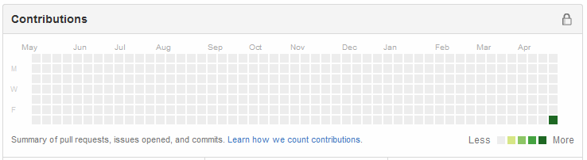

# Graph of Wolfram
Bookmarklet that turns the Github "Contributions" graph into 3457/357/5 Cellular Automaton, used in Wolfram Alpha loading indicator. 

## It looks like this

## Usage
Browse to a developers GitHub page, then scroll it so that the "Contributions" graph is visible.  
Open the developers console and copy-paste the script source code into it. Press enter to run the code and your "Contributions" graph should become alive.

## Known issues
Nowadays, some browsers are so secure they don't even allow userscripts and bookmarklets to be ran on websites with strict CSP turned on. So, this script may not work on some modern browsers. 
Try some alternative ones! They're cool.

## Security
Read the code and make sure that it's not malicious before copy-pasting and running it. Make sure there are no mangled up parts of unknown purpose that you are unable to understand at all.

## Credits
Automata code by Taylor Lopez, taken from https://jsfiddle.net/iAmMortos/espncctd/
